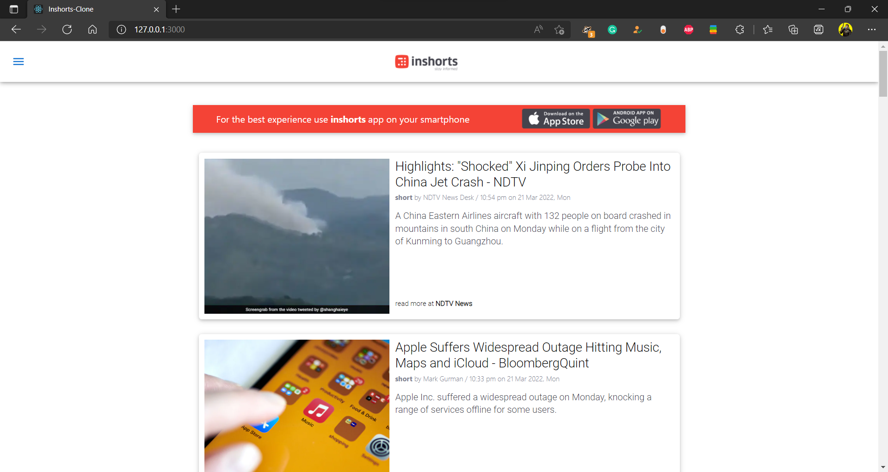
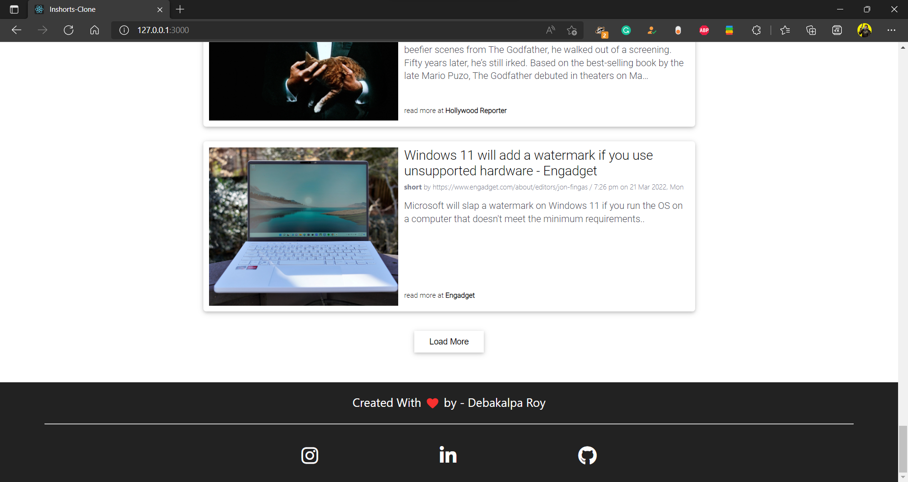
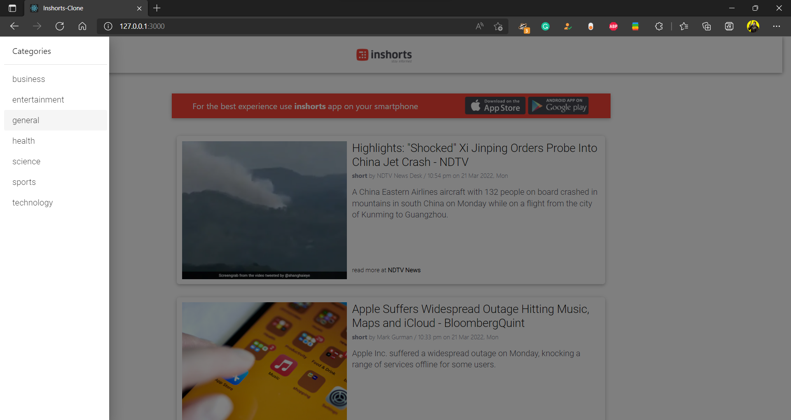

<div allign="center">
    
<div/>

# 
# React Inshorts Clone
<table>
<tr>
<td>
  This a clone of famous short news website inshorts.com built in React JS.
</td>
</tr>
</table>

## ⚠️ Important Note ⚠️
For some reason, News API only works on mozilla browsers in free plan other than that -
News api doesn't allow you to fetch the api from a deployed site. You can fork this repo and run in your local server and add your apikey in config.js file in the root.

## Demo
Make sure you're using Firefox or running it locally
Here is a working live demo : 

### Landing Page




### Choose from different Categories



## Built with 

- [React JS](https://reactjs.org/)
- [Material UI](https://material-ui.com/)

### Run it Locally

1. Get the API from ```newsAPI.org``` https://newsapi.org/
2. Create a config.js file in the ```src/data``` dirctory with the following
```
const apikey = '<KEY>';
export default apikey;
```
3. Install dependencies & start the server
```
npm install
npm start
```
The site willbe hosted on {LocalHost:3000}

---

## License

 Licensed under MIT © [Debakalpa Roy](https://github.com/DivineRoot)
